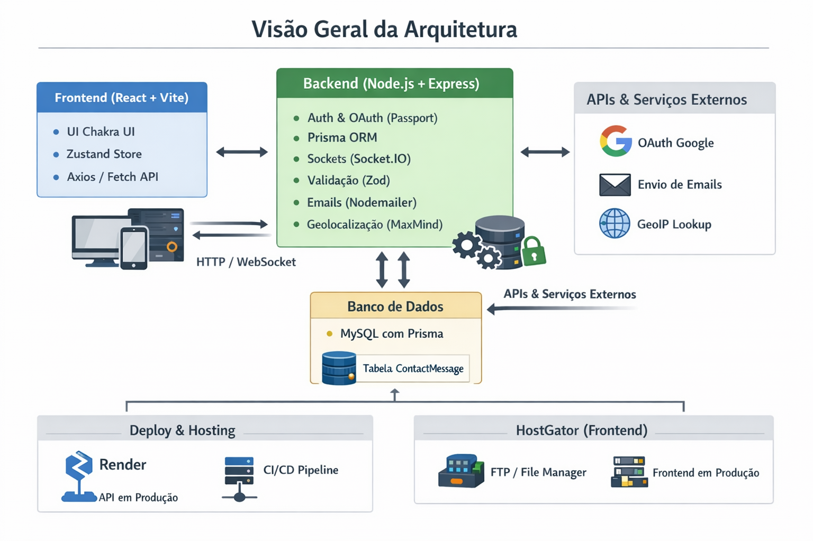

# 🌐 Valhalla Systems - Arquitetura de Sistemas

[]()
[](https://github.com/VagnerNjord)
[](LICENSE)

---

## 📖 Descrição

**Valhalla Systems** é um ecossistema full-stack desenvolvido para apresentar a empresa, seus serviços e soluções em Arquitetura de Sistemas, com foco em tecnologia moderna, animações sofisticadas, identidade visual marcante e experiência de usuário refinada.

O projeto segue padrões profissionais de desenvolvimento, escalabilidade e organização de front-end e back-end.

Este documento descreve com precisão o ecossistema, dependências e configurações utilizadas no desenvolvimento e implantação do projeto Valhalla Systems, que é composto por:

- 🌐 Site institucional
- 🔐 Sistema de autenticação
- 📖 Área do Leitor (conteúdo premium protegido)
- 👑 Painel administrativo de verificação
- 🛡️ Infraestrutura com hardening de segurança
- 🧠 Sistema de logs e auditoria

O projeto foi desenvolvido com foco em:

- Arquitetura escalável
- Segurança de aplicação
- Controle rigoroso de acesso
- Blindagem contra enumeração
- Estrutura profissional de deploy

---

## 🏗️ Arquitetura Geral

**Frontend**

- React 19 + Vite
- Chakra UI (Design System)
- Zustand (estado global)
- React Router DOM
- Framer Motion
- Proteção de conteúdo no DOM
- Build estático hospedado na Hostgator

**Backend**

- Node.js 22
- Express 5
- Prisma ORM
- MySQL 8
- Autenticação JWT
- Cookies HttpOnly + Secure
- Rate limiting segmentado
- Helmet + CSP + HSTS
- Logs estruturados com requestId

---

## ⚙️ Visão Geral



---

## 📁 Estrutura do Repositório

```bash
📂Valhalla_Systems/
├── 📂backend/    # API Node.js + Express + TypeScript
├── 📂docs/       # Documentação auxiliar do projeto
├── 📂frontend/   # Aplicação React + Vite + TypeScript
├── 📄.gitignore  # Arquivos e pastas a serem ignorados pelo Git
│── 📄LICENSE     # Licença do projeto
└── 📄README.md   # Documentação geral do projeto
```

---

## 🔐 Segurança Implementada

O sistema implementa múltiplas camadas de proteção:

### 🔒 Cookies Seguros

- HttpOnly
- Secure (produção)
- SameSite=None
- Domínio controlado
- HTTPS obrigatório

### 🛡️ Hardening de Headers

- Content-Security-Policy
- Strict-Transport-Security
- X-Frame-Options (DENY)
- frame-ancestors 'none'
- X-Content-Type-Options
- Referrer-Policy
- Permissions-Policy

### 🚫 Anti-Enumeração

- IDs opacos para assets
- Validação rigorosa de parâmetros
- Sanitização de req.params

### 📉 Rate Limiting

- Auth endpoints
- Admin endpoints
- Reader content endpoints

### 📊 Auditoria

- requestId por requisição
- Logs estruturados
- Registro de acesso a conteúdo
- Logs de OCR / Forense / Fraude

---

## 📖 Área do Leitor

Sistema premium protegido com:

- Controle de acesso baseado em verificação aprovada
- Progress tracking (capítulo, página, âncora, scroll)
- Assets protegidos via rota autenticada
- Cache privado
- Bloqueio para admin acessar área reader

---

## 👑 Painel Administrativo

Funcionalidades:

- Aprovar / Rejeitar verificações
- Download de comprovantes
- Logs de OCR
- Logs forenses
- Histórico de eventos
- Proteção anti-clickjacking

---

## 🌍 Infraestrutura

**Produção**

```bash
|  Camada    |       Serviço        |
|------------|----------------------|
| Frontend   | Hostgator            |
| Backend    | Render               |
| Banco      | MySQL Hostgator      |
| SSL        | HTTPS obrigatório    |
| Domínio    | valhallasystems.site |
```

---

## 🐳 Ambiente Local

- Docker Compose (MySQL + API)
- Prisma migrations
- Strict TypeScript
- tsx + nodemon

---

## 🗃️ Banco de Dados

Modelos principais:

- Reader
- Verification
- ReaderAsset
- ReaderProgress
- ContactMessage
- Logs (OCR / Forense / Fraude)
- RefreshToken
- PasswordResetToken

Prisma ORM com migrações controladas.

---

## 🚀 Deploy

**Backend (Render)**

Build:

```bash
npm install
npx prisma generate
npm run build
```

Start:

```bash
node dist/server.js
```

**Frontend (Hostgator)**

```bash
npm run build
```

Upload de _frontend/dist/_ via File Manager.

---

## 🧪 Desenvolvimento

**Backend**

```bash
npm run dev
```

**Frontend**

```bash
npm run dev
```

---

## 🔎 Monitoramento

- Logs via Render Dashboard
- Logs estruturados no backend
- Healthcheck endpoint /
- Controle de headers via DevTools

---

## 📌 Domínios

Produção:

- [valhallasystems.site](https://valhallasystems.site)
- [API valhallasystems.site](https://valhalla-systems.onrender.com/api)

Desenvolvimento:

- http://localhost:5173
- http://localhost:5000

---

## 🎯 Status do Projeto

✔ Produção ativa

✔ Área do leitor funcional

✔ Sistema de verificação completo

✔ Proteção de assets validada

✔ Cookies seguros funcionando

✔ Hardening final aplicado

---

## 📚 Documentação Detalhada

Para informações completas sobre cada aspecto do projeto, consulte os subdocumentos:

1.  [Ambiente de Desenvolvimento](./docs/01-ambiente-desenvolvimento.md)
2.  [Frontend Detalhado](./docs/02-frontend-detalhado.md)
3.  [Backend Detalhado](./docs/03-backend-detalhado.md)
4.  [Infraestrutura e Deploy](./docs/04-infraestrutura-deploy.md)
5.  [Comandos de Implantação](./docs/05-comandos-implantacao.md)

---

## 🖼️ Interface

**Demonstração no Youtube**

[](https://www.youtube.com/watch?v=S3WLzbWrIRw)

---

## ✨ Autor

**Vagner Njord**

🧭 Arquiteto de Sistemas | Autor do livro React e o Ecossistema Full-Stack

🔗 [LinkedIn](https://www.linkedin.com/in/vagner-bsilva) | [GitHub](https://github.com/valhalla-systems) | [Youtube](https://www.youtube.com/@Valhalla-Systems)

---

## 📜 Licença

Copyright (c) Valhalla Systems.

> All rights reserved.

> Este repositório é de uso interno e confidencial.

> Nenhuma parte deste código, documentação ou recursos pode ser copiada, distribuída, modificada ou publicada sem autorização expressa e por escrito da Valhalla Systems.

> O acesso a este repositório é estritamente limitado aos colaboradores autorizados.

> Violações serão tratadas de acordo com as leis aplicáveis de direitos autorais e propriedade intelectual.
